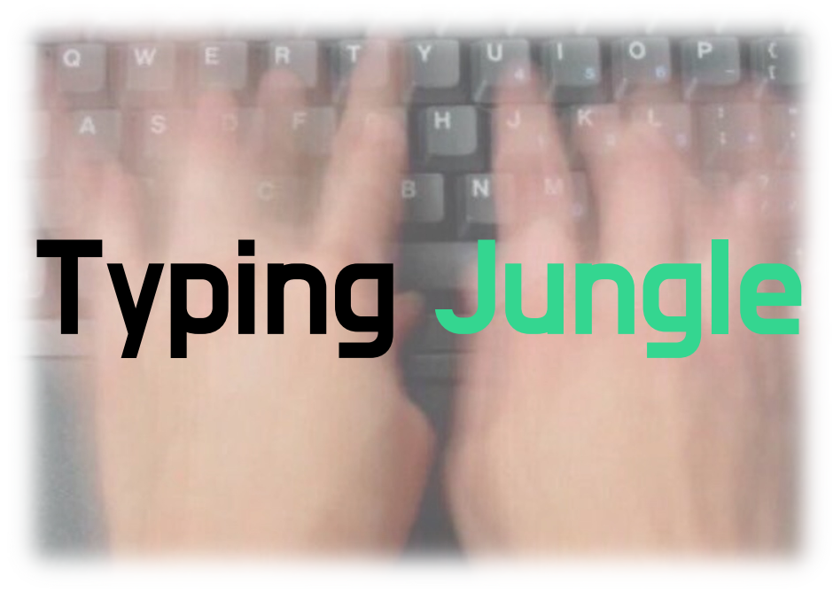
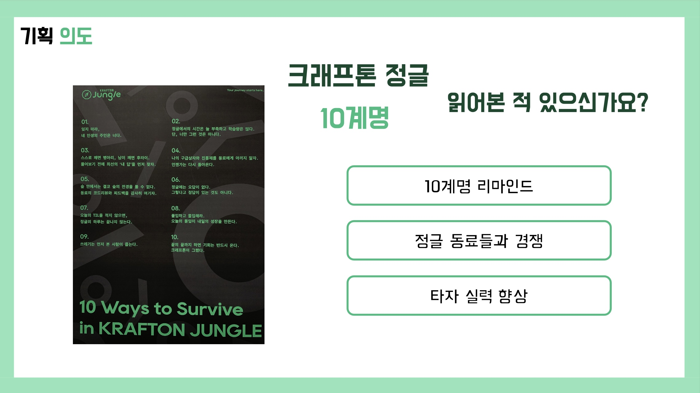
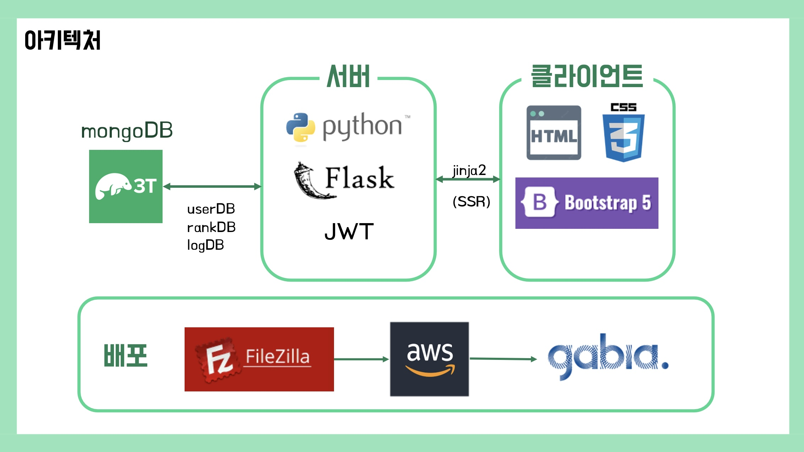
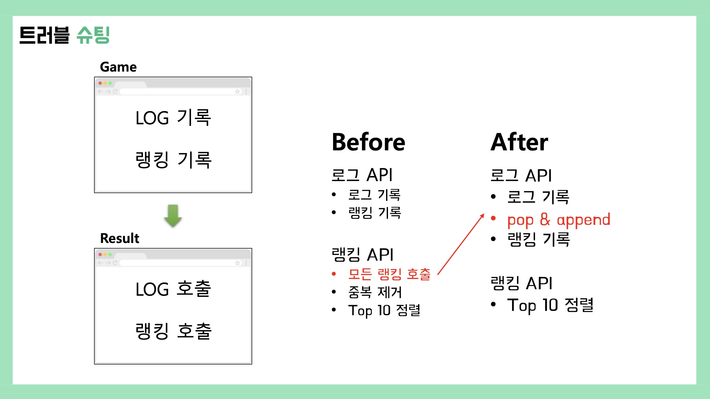

# typing_jungle  
## 크래프톤 정글 3기 🔥3박 4일 미니 프로젝트🔥

  

  <b>누구보다 빠르고 정확하게 정글 10계명을 입력하라!</b>

<!-- TABLE OF CONTENTS -->
## 목차

1. [프로젝트 개요](#outline)
2. [서비스 소개](#intro)
3. [기술 스택](#skills)
4. [시스템 아키텍쳐](#arch)
5. [트러블 슈팅](#troubleShooting)

 

## 1️⃣ 프로젝트 개요

### 📍 프로젝트 기간
|Date|Schedule|
|------|---|
|2023/10/10 (화) 19:00|프로젝트 시작|
|2023/10/11 (수) 09:30|제안 발표|
|2023/10/13 (금) 13:00|최종 발표|

### 📍 팀원 소개

  <table>
    <tr>
      <td align="center"><a href="https://github.com/hyrmzz1">양혜림</a></td>
      <td align="center"><a href="https://github.com/iwannabeit">최선빈</a></td>
      <td align="center"><a href="https://github.com/YellaCRE">황창조</a></td>
    </tr>
    <tr>
      <td align="center">FE</td>
      <td align="center">BE</td>
      <td align="center">BE</td>
    </tr>
  </table>

### 📍 기획 의도
<table border="0" >
  <tr>
      <td width="60%">
        

          
        

      </td>
      <td width="40%">
        

          <b>10 Ways to Survive in KRAFTON JUNGLE</b>
          <ol>
            <li>잊지 마라, 네 인생의 주인은 너다.</li>
            <li>정글에서의 시간은 늘 부족하고 학습량은 많다.  단, 너만 그런 것은 아니다.</li>
            <li>스스로 깨면 병아리, 남이 깨면 후라이.  물어보기 전에 최선의 ‘내 답’을 먼저 찾자.</li>
            <li>나의 구급상자와 진통제를 동료에게 아끼지 말자.  언젠가는 다시 돌아온다.</li>
            <li>숲 안에서는 결코 숲의 전경을 볼 수 없다.  동료의 코드리뷰와 피드백을 감사히 여기자.</li>
            <li>정글에는 오답이 없다.  그렇다고 정답이 있는 것도 아니다.</li>
            <li>오늘의 TIL을 적지 않으면,  정글의 하루는 끝나지 않는다.</li>
            <li>몰입하고 몰입해라.  오늘의 몰입이 내일의 성장을 만든다.</li>
            <li>쓰레기는 먼저 본 사람이 줍는다.</li>
            <li>끝의 끝까지 하면 기회는 반드시 온다.  크래프톤이 그랬다.</li>
          </ol>
        

      </td>
  </tr>
</table>

 

## 2️⃣ 서비스 소개

### 📍 로그인 화면

  

### 📍 메인 화면

  

### 📍 튜토리얼 모달 기능

  

### 📍 게임 화면

  

### 📍 결과 화면

  

 

## 3️⃣ 기술 스택

  
  
  
  
  
   
  
  
  
  
  

 

## 4️⃣ 시스템 아키텍쳐

  

 

## 5️⃣ 트러블 슈팅

  

